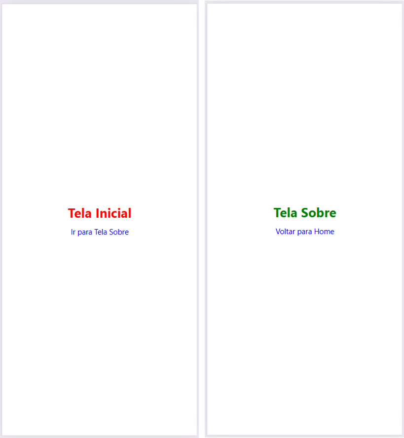

# 08-react-native

## Telas

# Exercícios

1. Altere o exemplo desta prática, criando a rota `contato.tsx` com o título “Contato”, adicione um `<Link>` na Home para abrir `/contato` e outro na nova tela para voltar para `/`.

2. Crie as telas de um aplicativo sobre currículo profissinal. Implemente a navegação entre as telas: home, currículo, perfil e sobre.

3. Crie as telas de um aplicativo para um catálogo promocional de produtos. Implemente as navegação entre as telas: home, promoções, pefil e sobre.

